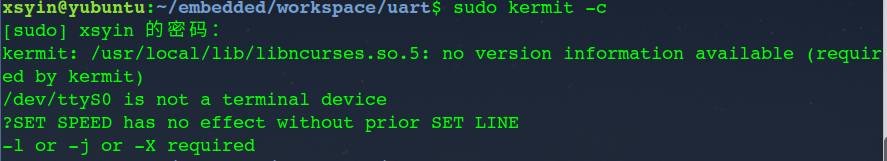

# Read Note 2    

[TOC]

> 在4、5周，结合书中源代码编码实现在开发板上实际运行，看至11章，有收获有疑惑。希望尽快进入U-Boot及Linux移植部分。 更新在[我的github](https://github.com/Xsyin) 中。    

----

## 1. Nand Flash

链接文件定义在stepingstone外即地址4096外的main部分，通过读Nand Flash至SDRAM中，之后跳转至SDRAM中执行。

收获：

* 汇编与C语言之间的参数传递，ATPCS规则。

* 通过操作相应的寄存器，实现Nand Flash的相关操作，重置，片选，写命令，写地址，初始化，读数据等一系列操作。    

  ​

## 2. 中断体系结构

通过中断方式，一个开关按下点亮一个LED，同时按下多个，响应优先级高的中断开关。

收获：

*  中断体制：  开关按下后，已被设置为表示中断源的GPFDAT变为1,相应的寄存器SUBSRCPAND，SRCPND为1,因未设置MASK，则相应的INTPND为1,若同时有多个中断源，则通过PRIORITY寄存器配置优先级顺序；INTOFFSET表示当前处理中断源的中断号。CPU通过读取INTMODE为IRQ，找到相应的中断向量，向量即为中断服务程序的入口地址，随后跳转至中断服务程序ISR，通过INTOFFSET分发操作。之后清除SRCPND，INTPND。
*  第一次注意Makefile文件中.o文件的顺序，书写顺序即为编译生成的先后顺序，查找好久后才发现是这个错误。

## 3. 系统时钟与定时器

通过定时器与中断结合实现每一秒变换LED灯的状态。

* 通过CLKDIVN，MPLLCON配置FCLK，PCLK，HCLK，更改总线模式。HCLK影响SDRAM的刷新频率，PCLK与定时器相关。
* 通过TCFG0,TCFG1寄存器配置定时器0的频率，TCNTB0配置定时器的初始值，TCON开启定时器与配置自动装载。


## 4. UART

通过UART通信协议，在开发板中将输入加1后输出，其中`0`-->`9`，`z`-->`a` ，`Z`-->`A` 。

**问题：** 在Ubuntu中安装`Ckermit` 与开发板进行串口通信，按书中编写配置文件`.kermrc` ：

``` shell
set line /dev/ttyS0
set speed 115200
...
```

 连接时出现错误：

 

**解决：** 经google后，将配置文件中`/dev/ttyS0` 改为`/dev/ttyUSB0` 后正常工作，但其中原理还不甚了解。


 


