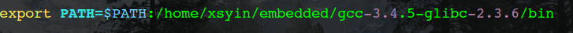
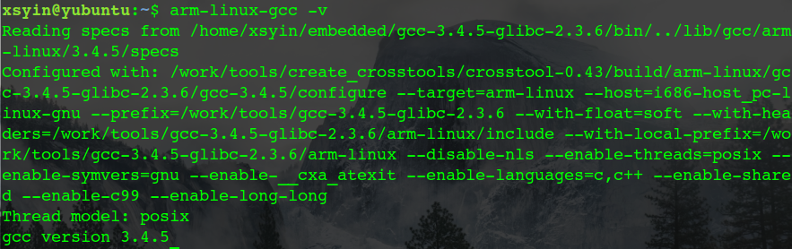
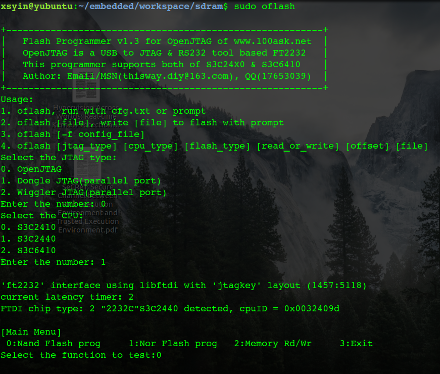

#Readnote 1
------
[TOC]  
> 在2、3周时间，因为有着之前基础，将《嵌入式Linux应用开发完全手册》一书看到了第七章，同时将书上例子付诸实践，并未观看视频，实践代码在[我的github](https://github.com/Xsyin/Embedded.git) 中。本读书笔记为这两周中遇到的问题及解决方法。--by xsyin 
星期四, 21. 九月 2017 11:10下午 

------

##环境搭建
本人系统环境为Ubuntu 16.04,之后所有操作都在此环境下进行。

- 交叉编译工具链 
  当尝试使用光盘工具中`crosstool`脚本自己编译工具链时，遇到`gcc`版本过高引起的很多错误。因此使用制作好的`gcc-3.4.5-glibc-2.3.6`中的工具，解压，将路径加入`PATH`： 
   
验证成功安装:

工具链的用法在之后的例子实践中熟练，包括makefile的书写。

##GPIO操作LED
###问题1
  照书中程序代码编译链接烧入norflash后，LED灯并不亮？
**解决**：
 书中代码与当前开发板不符，LED数量也不同，经查看`JZ2440v2_sch`后发现`LED0->GPF4`,`LED2->GPF5`,`LED4->GPF6`,于是在`CPU三星S3C2440A芯片手册`中查找`GPFCON`与`GPFDAT`寄存器地址，更改相应代码，重新烧写后LED灯亮。按键对应寄存器一样更改。
 
##存储控制器访问SDRAM
###问题1
用C语言点亮LED时，烧入norflash中，LED灯并不亮？
**解决：**
经查询资料得知原因：
> 由于要跳转到main()函数中去执行，即C函数中去，就需要使用堆栈。代码“ldr     sp, =0x00001000”由于使用堆栈的地址位于norflash中，而当跳转到main()函数中去执行时，就会写norflash，而norflash不能像RAM那样随意写，所以不能成功执行。代码“ldr     sp, =0x40001000”由于使用堆栈的地址是0x40001000，使用的是（0x40000000—0x40001000），即是S3C2440的片内SRAM。这样跳转到main()函数时，用到的     就是片内SRAM，所以能够成功执行。

**解决结果：** 
cfg.txt:

	# jtag(0:openjtag, 1:dongle并口, 2:wiggler并口) cpu(0:s3c2410, 1:s3c2440， 2: s3c6410)  flash(0:nand, 1:nor)  read/write(0:write, 1:read)  offset   file
	0 1 0  0 0 sdram.bin
	
烧写：

##MMU使用
###问题1
MMU示例代码中协处理指令`mcr`,`mrc`,cp15的操作？
**解决：**
查找资料：*《ARM体系结构与编程》-杜春雷*中有详细讲解。

